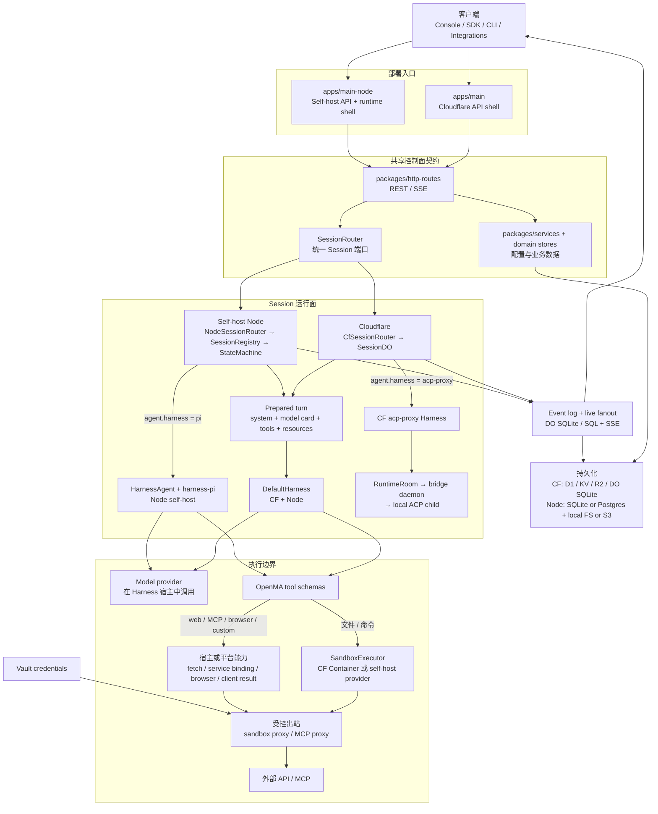
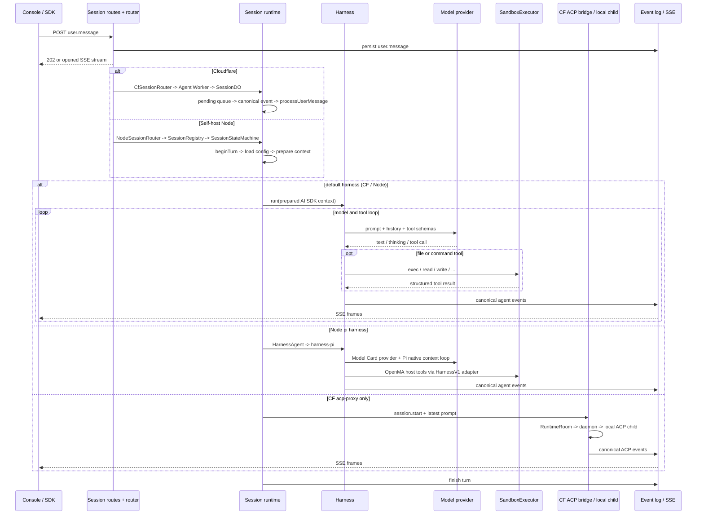

# Open Managed Agents — 当前系统架构

> 本文描述仓库的**当前实现**，用于帮助开发者定位模块、理解 Session 主链路和判断改动边界。
> 设计原则见 [architecture.md](./architecture.md)，self-host 部署与运维见
> [self-host.md](./self-host.md)。本文会明确区分“已实现”和“目标能力”，不把归档 RFC
> 或尚未落地的研究写成生产能力。

## 1. 核心心智模型

Open Managed Agents（OMA）是一个 **meta-harness 平台**：平台负责持久状态、配置、
工具与执行环境，Harness 负责一轮 Agent 如何使用模型和工具。

| 概念            | 它是什么                                                             | 不是什么                    |
| --------------- | -------------------------------------------------------------------- | --------------------------- |
| **Agent**       | 带版本的配置：model handle、system prompt、tools、skills、harness 等 | 长驻进程                    |
| **Session**     | 一次可恢复对话及其 append-only event log                             | Agent 配置本身              |
| **Environment** | 沙箱执行约束：packages、networking、image 等                         | 模型 Provider 配置          |
| **Model Card**  | Provider 格式、wire model、base URL、API Key、headers                | 注入沙箱的普通环境变量      |
| **Harness**     | Agent loop：上下文派生、模型调用、tool loop、compaction、停止条件    | 沙箱实现                    |
| **Tools**       | 提供给模型的能力定义，如 `bash/read/write/edit/glob/grep`            | 一律进入 Sandbox 的函数     |
| **Sandbox**     | `SandboxExecutor` 背后的工具执行环境                                 | 模型调用所在位置            |
| **Event Log**   | Session 的持久事实来源；SSE/Timeline 都从事件派生                    | 仅供前端显示的临时消息列表  |
| **Vault**       | 给受控出站链路注入凭据，如 sandbox outbound 或 MCP proxy             | LLM Provider Key 的配置入口 |

主要类型和接口位于：

- [`AgentConfig`](../packages/api-types/src/types.ts)
- [`SessionRouter`](../packages/session-runtime/src/router.ts#L102-L158)
- [`HarnessInterface` / `HarnessContext`](../apps/agent/src/harness/interface.ts)
- [`SandboxExecutor`](../packages/sandbox/src/ports.ts)

## 2. 核心模块全景



这张图最重要的三个边界是：

1. **共享的是契约，不是所有实现。** 两种部署共用 HTTP route、store port、
   `SessionRouter` 和 `SandboxExecutor`；CF 与 Node 的 turn orchestration 目前仍不同。
2. **模型在 in-process Harness 宿主中调用；只有需要环境执行的文件/命令工具进入
   Sandbox。** `web_search`、remote MCP、browser 和 custom tool 走各自的平台能力。
   Model Card Key 用于宿主侧 Provider 调用，不需要放进 Sandbox。
3. **Event Log 是事实来源。** Console 的 Conversation、Timeline、Trajectory 和 SSE
   都是事件的不同投影。

`acp-proxy` 是独立旁路：它把最新 prompt 交给本地 ACP child，由外部 agent 管理模型、
上下文和工具，不复用 OpenMA Model Card、AI SDK model、OpenMA tools 或 Session sandbox；
它复用的是 Session transport、canonical events、interrupt 和平台控制面。

## 3. 控制面

### 3.1 API shell

- Cloudflare 入口是 [`apps/main/src/index.ts`](../apps/main/src/index.ts)，负责认证、
  tenant、限流、Cloudflare bindings 和 CF-only 路由。
- Self-host 入口是 [`apps/main-node/src/index.ts`](../apps/main-node/src/index.ts)，负责
  SQLite/Postgres、文件存储、Node sandbox provider、Console 静态文件和 `oma-vault` 装配。
- 两端把 Agent、Session、Vault、Memory 等公共行为挂到
  [`packages/http-routes`](../packages/http-routes/src)；runtime 差异通过注入的 adapter
  和 lifecycle hooks 处理。

### 3.2 配置与存储

业务路由通过 store/service port 访问数据，而不是直接依赖某一种数据库：

| 领域                          | 主要模块                                             | CF 实现                  | Node self-host 实现               |
| ----------------------------- | ---------------------------------------------------- | ------------------------ | --------------------------------- |
| Agent / Environment / Session | `*-store` + `packages/services`                      | D1 / KV / bindings       | SQLite 或 Postgres                |
| Model Card                    | `packages/model-cards-store`                         | 加密 Key + D1 元数据     | 加密 Key + SQLite/Postgres 元数据 |
| Session events                | `packages/event-log`                                 | 每个 SessionDO 的 SQLite | 中央 `session_events` SQL 表      |
| Files / Memory                | `packages/blob-store`、`files-store`、`memory-store` | R2 + D1 index            | local FS 或 S3 + SQL index        |
| Vault credential              | `credentials-store`、`vault-forward`                 | CF outbound handler      | `apps/oma-vault` sidecar          |

不要依赖固定的 app/package 数量理解仓库；稳定的是这些职责边界，workspace 会继续增加
独立 package。

## 4. Session 主链路

### 4.1 公共入口

[`buildSessionRoutes`](../packages/http-routes/src/sessions/index.ts#L651-L847) 同时被 CF 和 Node
挂载，常用入口是：

- `POST /v1/sessions/:id/events`：追加一个或多个 typed events，接受后返回 `202`。
- `POST /v1/sessions/:id/messages`：便利接口；先订阅 stream，再追加一条
  `user.message`，直到收到 `session.status_idle`。
- `GET /v1/sessions/:id/events`：JSON 查询；`Accept: text/event-stream` 时转为 SSE。
- `GET /v1/sessions/:id/events/stream`：显式 SSE 入口。

### 4.2 一轮消息如何执行



公共抽象到这里结束；两个 runtime 的内部实现不同。

### 4.3 Cloudflare 路径

1. [`CfSessionRouter`](../apps/main/src/lib/cf-session-router.ts#L85-L179) 通过 service binding 把
   event/stream 请求转给 Agent Worker。
2. [`apps/agent/src/index.ts`](../apps/agent/src/index.ts) 按 session ID 找到
   `SessionDO`。
3. [`SessionDO`](../apps/agent/src/runtime/session-do.ts) 管理 pending queue、DO SQLite
   event log、WebSocket fanout、环境 warmup、资源挂载和 turn lifecycle。
4. SessionDO [根据 `agent.harness` 从 registry 选择 Harness](../apps/agent/src/runtime/session-do.ts#L4248-L4258)；当前编译进 Worker 的只有
   [`default` 和 `acp-proxy`](../apps/agent/src/index.ts#L12-L17)。
5. SessionDO 准备 model、tools、system prompt、history、resources 和 abort signal，
   再调用 `harness.run(ctx)`。

CF **尚未**把 turn orchestration 切换到共享 `SessionStateMachine`；相关生命周期代码
仍在 SessionDO 内。`packages/session-runtime` 中的注释把这一迁移标成后续阶段。

### 4.4 Self-host Node 路径

1. [`NodeSessionRouter`](../apps/main-node/src/lib/node-session-router.ts#L59-L92) 先写
   `SqlEventLog` 并发布到 `EventStreamHub`。
2. [`SessionRegistry`](../apps/main-node/src/registry.ts) 为 session 懒创建 sandbox、
   adapter、stateful Harness controller 和 `SessionStateMachine`。
3. [`SessionStateMachine.runHarnessTurn`](../packages/session-runtime/src/machine.ts#L140-L183)
   依次执行 `loadAgent`、`beginTurn`、mounts、`prepareTurn`、`run`、`endTurn`。
4. [`apps/main-node/src/index.ts`](../apps/main-node/src/index.ts) 根据 `agent.harness`
   选择 `default` 或 `pi`。未知值在调用 Provider 前 fail-fast。
5. `pi` 通过官方 `HarnessAgent` + `@ai-sdk/harness-pi` 运行；Model Card 仍是模型、
   Base URL 和 Key 的唯一配置源，OpenMA tools 与 Session sandbox 继续复用。

Node 正常 turn 目前只把 session row 切回 `idle`，没有像 CF 一样保证发出
`session.status_running/session.status_idle` canonical events；而 `/messages` 会等待
`session.status_idle` 才关闭。这是当前已知的 runtime 对齐缺口。

## 5. Harness、Tools 与 Sandbox 边界

### 5.1 平台准备 WHAT，Harness 决定 HOW

平台在调用 Harness 前准备：

- Agent / Environment 配置和 Session resources
- Model Card 对应的 provider model
- system prompt、skills、memory reminders
- OpenMA tools
- event history、broadcast、abort、usage 等 runtime capability
- Session-scoped sandbox

Harness 决定：

- 事件如何派生成模型上下文
- 何时压缩、保留哪些 tool results
- 一轮执行多少步、何时停止
- 如何解释 stream delta 并产生 canonical Agent events

CF 的 [`HarnessContext`](../apps/agent/src/harness/interface.ts) 仍直接使用 AI SDK
`LanguageModel` 和 AI SDK-shaped tools。Node 的共享 `SessionStateMachine` 已只依赖
`PreparedHarnessTurn.run()`，具体 model/harness context 留在 runtime shell；因此 Node 的
turn lifecycle 已 backend-neutral，但两种部署尚未统一到同一个 harness adapter seam。

### 5.2 Tools 由 OpenMA 定义

默认工具在 [`apps/agent/src/harness/tools.ts`](../apps/agent/src/harness/tools.ts) 中构建，
包括 `bash/read/write/edit/glob/grep/web_fetch/web_search` 等。工具的 schema 和事件语义
属于 OpenMA，但执行位置按能力不同：

- 文件与命令操作最终委托给 `SandboxExecutor`；
- `web_search` 在 Harness 宿主发起请求；
- remote MCP 经 main worker service binding 和 MCP proxy；
- browser 走 `BrowserHarness`；custom tool 等待 client result，不在服务端直接执行。

Node 的 Pi 接入会禁用 Pi 自带文件/命令工具，将模型发出的 tool call 交给
`HarnessAgent` 执行 OpenMA 已构建的 tools。这样 permission policy、canonical
`agent.tool_use/result` 事件和 Session sandbox 边界不分叉。OpenMA 的 canonical 路径
仍是 `/workspace`；HarnessV1/Pi 内部为每个 Session 使用唯一逻辑 VFS mount，
adapter 再映射回该 Session root，避免 Pi process-global `fs` patch 在并发时
互相截获文件操作。

### 5.3 Sandbox provider

[`SandboxExecutor`](../packages/sandbox/src/ports.ts) 是公共执行端口；
[`DefaultSandboxOrchestrator`](../packages/sandbox/src/orchestrator.ts) 封装 credential proxy、
memory mounts、session outputs 和 workspace backup/restore，但当前只有 Node runtime 使用它。
CF 仍由 `SessionDO`、resource mounter 和 Cloudflare sandbox adapter 分别装配这些能力。

| 部署           | 当前实现                                                    |
| -------------- | ----------------------------------------------------------- |
| Cloudflare     | `CloudflareSandbox` / Container                             |
| Node self-host | `subprocess`、`litebox/boxlite`、`boxrun`、`daytona`、`e2b` |

`local-subprocess` 只是带 session workdir 的宿主子进程，**不是安全沙箱**，并且当前会继承
[完整 `process.env`](../packages/sandbox/src/adapters/local-subprocess.ts#L498-L507)。只应在可信开发场景使用；不可信 Agent 应选择具备隔离能力的 provider。

### 5.4 Provider Key 与 Vault credential 是两条链路

```text
Model Card API Key ──> Harness 宿主 ──> LLM Provider

Vault credential ──> sandbox outbound proxy ──> Sandbox 发起的外部请求
                 └─> MCP proxy ───────────────> Remote MCP request

上述两条受控链路都不把原始 Vault token 交给 Harness 或 Sandbox。
```

“Vault token 不进入 Sandbox”只适用于经过 credential proxy 的 Vault 凭据，不能推导成
“Sandbox 看不到宿主环境变量”。尤其 `local-subprocess` 当前仍继承宿主进程环境。

## 6. 配置对象如何进入一轮运行

| 配置              | 创建/管理入口              | 运行时用途                                   | 当前差异                                                                                               |
| ----------------- | -------------------------- | -------------------------------------------- | ------------------------------------------------------------------------------------------------------ |
| Agent             | Console / Agents API       | model handle、prompt、tools、skills、harness | Session API 会保存 snapshot；Node turn 目前仍重新读取当前 Agent                                        |
| Model Card        | Console / Model Cards API  | provider、wire model、base URL、key、headers | Node 必须存在有效卡；CF 仍保留部分 env fallback                                                        |
| Environment       | Console / Environments API | sandbox packages、networking、image          | CF 用于 environment Worker/container；Node provider 由全局 `SANDBOX_PROVIDER` 选择，配置主要传给 tools |
| Session resources | Session API                | file、memory store、outputs 等挂载           | provider capability 不同时可能降级或不支持                                                             |
| Vault             | Console / Vault API        | 受控出站鉴权                                 | sandbox outbound 与 MCP proxy；Node sandbox 路径使用 `oma-vault` sidecar                               |

因此：**Provider 优先在 Model Cards 页面配置，Environment 不承担 Provider 配置。**

## 7. 当前 Harness 能力边界

| 能力                                | 状态           | 说明                                                      |
| ----------------------------------- | -------------- | --------------------------------------------------------- |
| DefaultHarness                      | 已实现         | 基于 AI SDK 的 model/tool loop、stream 与 compaction      |
| CF `acp-proxy`                      | 已实现但有前提 | 需要 Runtime binding、在线 daemon 和 ACP-compatible agent |
| CF 内部注册新 Harness               | 已实现         | 修改代码并编译部署；不是运行时上传插件                    |
| Node 按 Agent 切换 Harness          | 已实现         | `agent.harness` 为 `default` / `pi`；未知值 fail-fast      |
| Pi SDK Harness                      | 已实现（Node） | 官方 HarnessV1；复用 Model Card、OpenMA tools 与 sandbox   |
| `oma deploy --harness ...`          | **未实现**     | 仅存在于归档设计，不是当前 CLI 能力                       |
| 完全 backend-neutral HarnessContext | **未实现**     | 当前接口仍绑定 AI SDK `LanguageModel` / tools             |

目标上的多 Harness 选择点应位于 Session runtime 与具体 backend 之间：

```text
Session runtime
      │ agent.harness
      ▼
Harness adapter registry
      ├── default
      ├── pi (Node-only)
      └── acp-proxy
```

三个 backend 并未在两种部署中全部可选：CF 是 `default/acp-proxy`，Node 是
`default/pi`。当前 schema 没有独立 `backend` 字段；选择点就是 `agent.harness`。

## 8. Event Log、Streaming 与恢复

- `user.message`、最终 `agent.message`、tool use/result、session status 和 span 是
  canonical events。
- 模型 stream chunk 是临时增量，不应等同于最终 canonical event。
- CF 将 stream buffer 与 canonical event 分开处理，并通过 DO WebSocket 转为外部 SSE。
- Node 的 `NodeHarnessRuntime` 当前会持久化 canonical events 并推送 hub，但 live chunks
  主要是进程内 fanout，和 CF 的 durable stream recovery 仍不完全对齐。
- crash recovery 是基于 event log 的重建与 orphan-turn reconciliation；它不是“从任意
  JavaScript 指令精确续跑”。中断工具调用可能需要 placeholder/partial result，执行语义
  是可恢复而非 exactly-once。
- Pi 在每个成功 turn flush canonical events 后调用 `session.stop()`，校验
  `/workspace/.pi-sessions` 中的 native journal 非空，并要求它相对上一个
  checkpoint 内容发生变化；journal 与 resume state 都通过同目录临时文件原子替换，再保存
  `/workspace/.openma/pi-resume.json`。新进程通过 `createSession({ resumeFrom })`
  恢复到上一个已完成 turn；mid-turn crash 不保证精确续跑。
- Pi checkpoint/resume 已用 `local-subprocess` 验证进程重启；远程 sandbox
  provider 的 snapshot/restore 尚未验证。

对应实现：

- CF event log：[`packages/event-log/src/cf-do`](../packages/event-log/src/cf-do)
- SQL event log：[`packages/event-log/src/sql`](../packages/event-log/src/sql)
- Node live fanout：[`apps/main-node/src/lib/event-stream-hub.ts`](../apps/main-node/src/lib/event-stream-hub.ts)
- recovery：[`packages/session-runtime/src/recovery.ts`](../packages/session-runtime/src/recovery.ts)

## 9. 修改代码时从哪里进入

| 目标                  | 首要入口                                                                                         | 还要检查                                                   |
| --------------------- | ------------------------------------------------------------------------------------------------ | ---------------------------------------------------------- |
| 改公共 REST/SSE 行为  | `packages/http-routes`                                                                           | `CfSessionRouter`、`NodeSessionRouter`                     |
| 改 Session lifecycle  | `apps/agent/src/runtime/session-do.ts`（CF）或 `packages/session-runtime/src/machine.ts`（Node） | 两个 runtime 的状态/事件一致性测试                         |
| 改默认 Agent loop     | `apps/agent/src/harness/default-loop.ts`                                                         | compaction、history projection、event contracts            |
| 新增 Harness backend  | CF registry 或 Node `createHarnessController`                                                     | model/tools/context、interrupt、close、event mapping       |
| 新增或修改工具        | `apps/agent/src/harness/tools.ts`                                                                | 所有 `SandboxExecutor` adapter                             |
| 新增 Sandbox provider | `packages/sandbox/src/adapters`                                                                  | `apps/main-node` provider map、self-host capability matrix |
| 改模型 Provider       | `apps/agent/src/harness/provider.ts`                                                             | Model Card schema、Console 表单、两种 runtime              |
| 改存储                | 对应 `*-store` port/adapter                                                                      | services 装配、schema、CF/Node migration                   |
| 改 Session UI         | `apps/console/src`                                                                               | 用真实 SSE/大 event log 走 Conversation 与 Timeline        |

## 10. 非核心但相关的系统

- Integrations：[`apps/integrations`](../apps/integrations) 与
  [`packages/integrations-core`](../packages/integrations-core)
- Eval / Trajectory：[`packages/eval-core`](../packages/eval-core) 与
  [trajectory-v1-spec.md](./trajectory-v1-spec.md)
- RL：[`rl`](../rl) 是 Session API / trajectory 的消费者，不在在线 Harness 主循环中
- Local ACP runtime：[`packages/acp-runtime`](../packages/acp-runtime)；设计背景见
  [external-agent-runtime.md](./archive/external-agent-runtime.md)

## 11. 相关文档

- [Meta-Harness 设计原则](./architecture.md)
- [Self-host 部署与 Sandbox capability matrix](./self-host.md)
- [Node Pi Harness 使用与限制](./harness-pi.md)
- [凭据代理架构](./mcp-credential-architecture.md)
- [Console 开发循环](./console-dev-loop.md)
- [Trajectory v1](./trajectory-v1-spec.md)
